# 📘 Personal Tuition Manager (Offline)  

**Your private, secure, and powerful assistant for managing tuition students.**  
Designed for teachers who want full control over attendance, payments, and courses — **100% offline, no internet needed.**  

---

## 🔐 Secure Access  
- **PIN-protected** entry with a 4-digit lock screen  
- Set up a **security question and answer** during first-time setup  
- Change your PIN anytime by verifying your security answer  
- **Logout** anytime to return to the lock screen  

---

## 📅 Attendance Tracking  
- **Interactive calendar** to track attendance month-by-month  
- Tap any date → use the **floating calendar button** to mark attendance  
- Select students from a bottom sheet list and confirm  
- **Daily attendance count** shown as green badges (e.g., "3")  
- **Today's date** highlighted with a circle  
- View all attendees as cards below the calendar  
- Navigate between months to review past attendance  

---

## 💸 Payment Management  
- Record **unlimited payments** per student  
- **Add payments** with:  
  - Date selection  
  - Amount entered  
  - Linked student  
- **Edit** (swipe right) or **delete** (swipe left) payments  
- **Monthly summary cards** show earnings at a glance  
- **Interactive line graph** displays payment trends  
- Payment status tags:  
  - `No course` | `Ongoing` | `Completed` | `Not started`  

---

## 📚 Course Management  
Courses are payment-linked with strict limits:  
- **1 ongoing** + **1 waitlisted** course per student max  
- Automatic selection of oldest payment when creating courses  

### 🔄 Ongoing Courses  
- Active classes in progress  
- Features:  
  - Update start dates  
  - Complete course when all classes are done  
  - **Visual timeline** (blue = past, red = future, gray = holidays)  
  - "Credit" tag appears for additional payments  

### ⏳ Waitlisted Courses  
- One allowed per student  
- Created only for payments without existing courses  

### ✅ Closed Courses  
- View-only mode with calendar-style timeline  
- Deleted only if linked payment is removed  

**Sort options**:  
- Start date | End date | Total classes  
- Ascending/descending order  

---

## 👨‍🎓 Student Management  
- **Swipe controls**:  
  - Left → Delete  
  - Right → Edit  
- Student cards show:  
  - Unique ID  
  - Join duration (e.g., "Joined 3 months ago")  

---

## ☰ Navigation Menu  
- **My Holidays**: Manage custom/weekly holidays  
- **About**: Developer information  
- **Logout**: Returns to PIN screen  
- **Theme Selector**: Bottom of menu  

## 🏖️ Holiday Management  
### Custom Holidays  
- Tap **+** to add any date  
- Add descriptive reasons (e.g., "School Break")  

### Weekly Off-Days  
- Set recurring weekly closures  
- Visual indicators:  
  - Gray = non-working days  
  - Accent color = selected dates  

---

## 🎨 Theme Options  
- **Dark mode** - Easy night viewing  
- **Light mode** - Bright interface  
- **System default** - Matches device settings  
*Preferences save automatically*  

---

# 📸 App Screenshots

## 🔐 Security & Setup
| Feature | Screenshot |
|---------|------------|
| PIN Lock Screen | 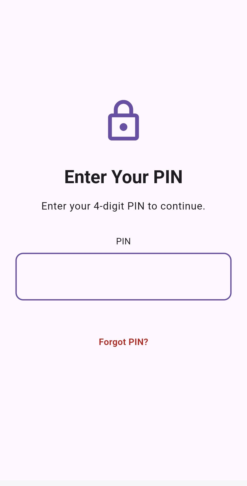 |
| First-Time PIN Setup | 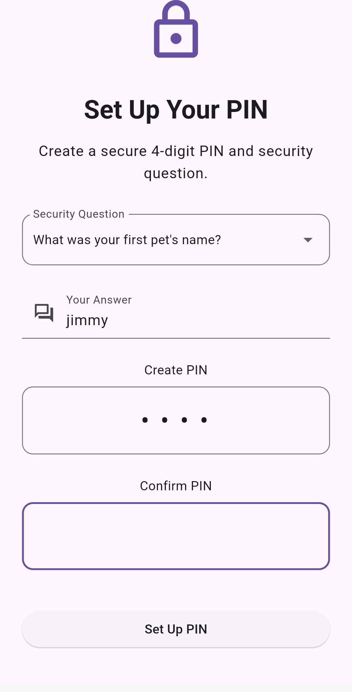 |
| Logout Confirmation | 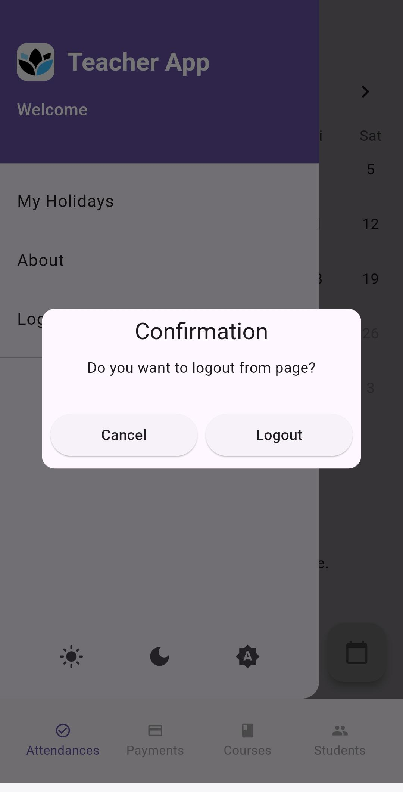 |

## 👨‍🎓 Student Management
| Feature | Screenshot |
|---------|------------|
| Student List | 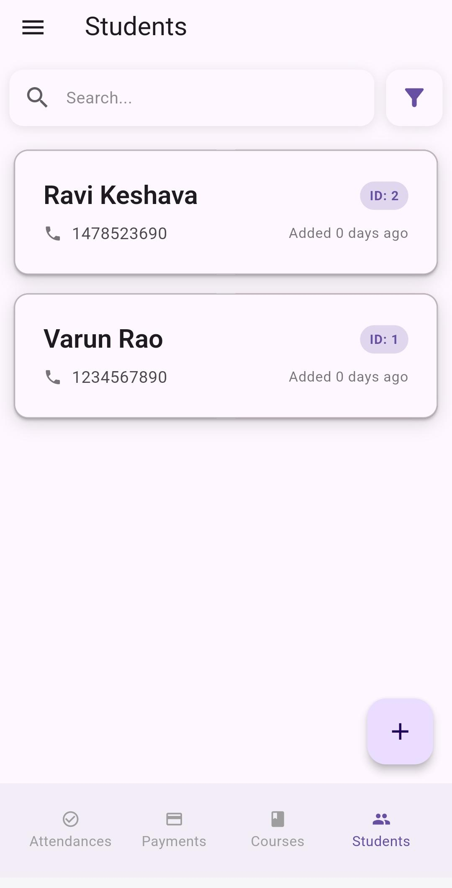 |
| Add New Student | 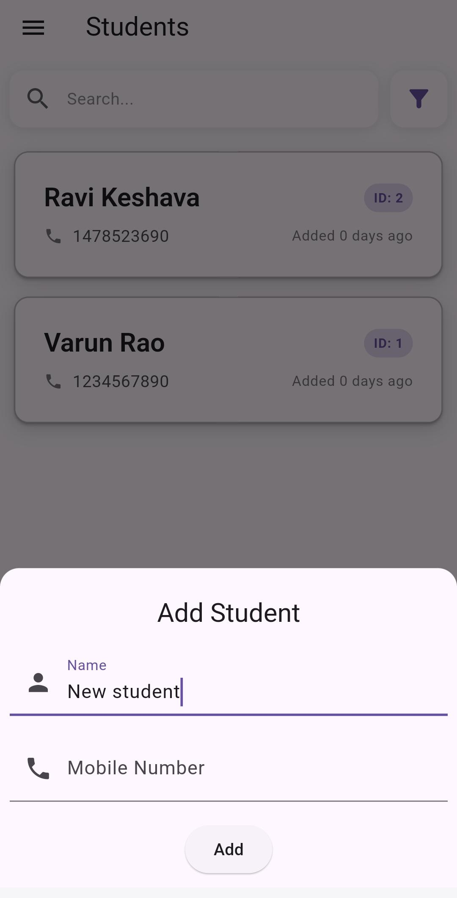 |
| Sort Students | 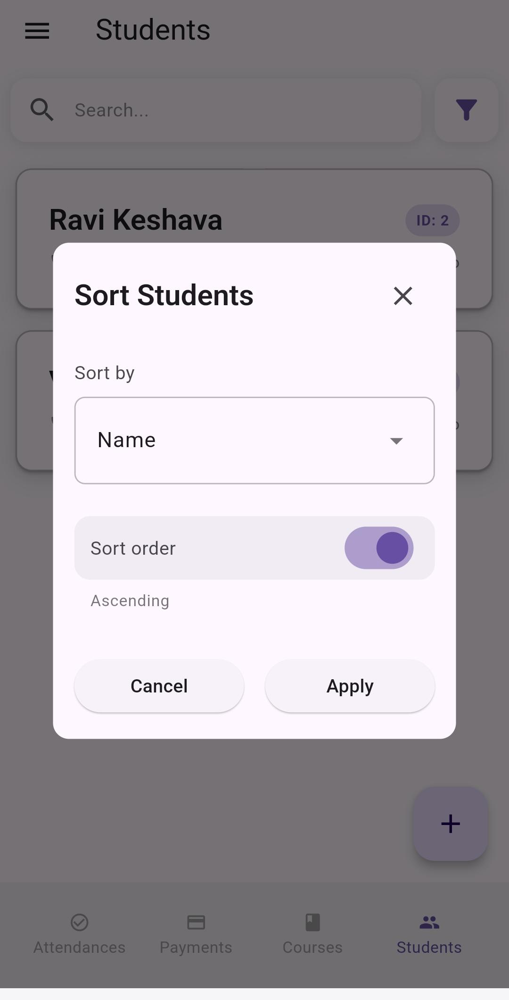 |

## 📅 Attendance Tracking
| Feature | Screenshot |
|---------|------------|
| Attendance Calendar | 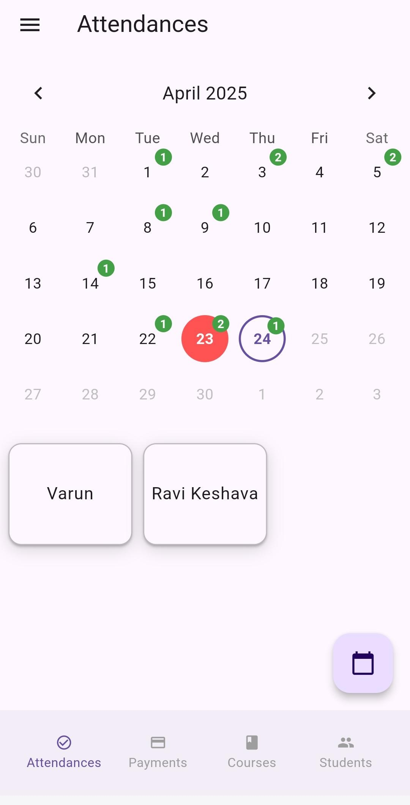 |
| Mark Attendance | 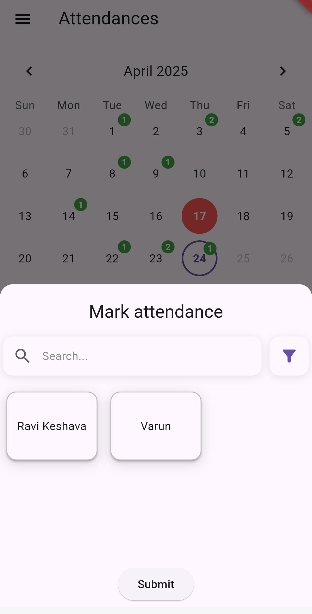 |

## 💸 Payment Management
| Feature | Screenshot |
|---------|------------|
| Payment Dashboard | 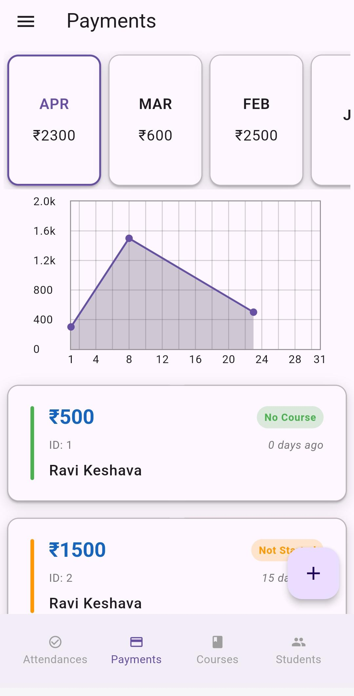 |
| Add Payment | 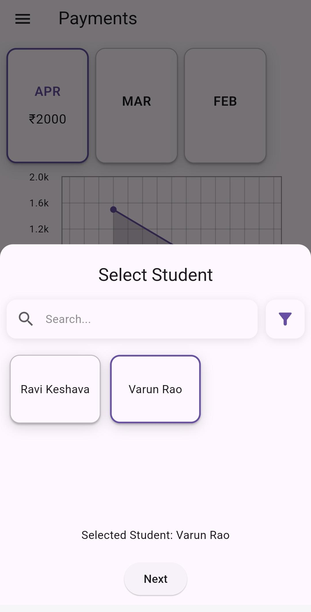 |

## 📚 Course Management
| Feature | Screenshot |
|---------|------------|
| Course Overview | 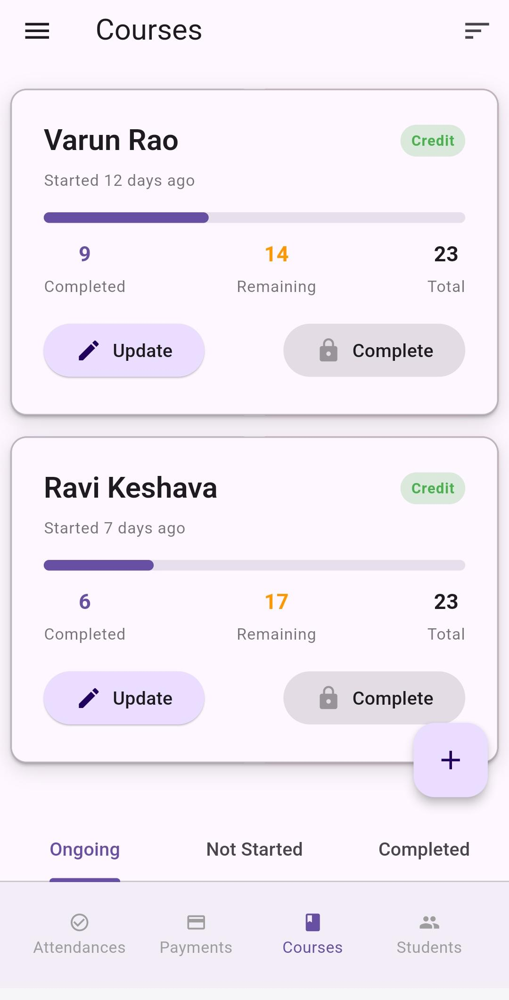 |
| Sort Courses | 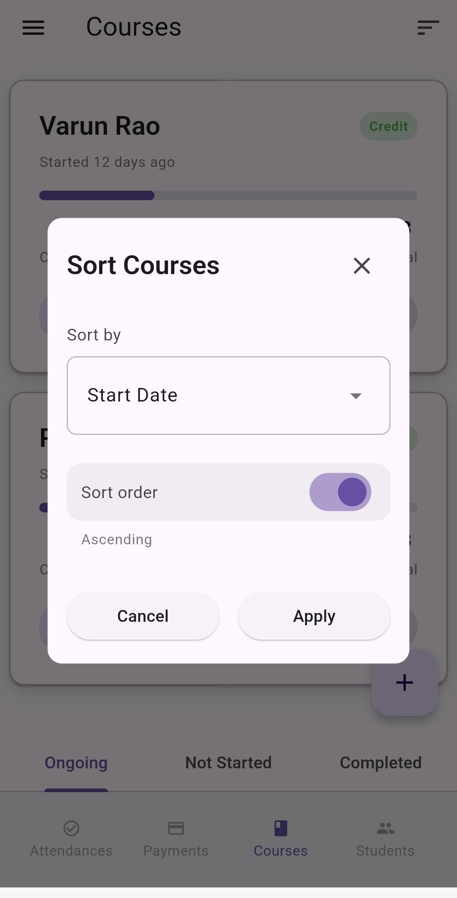 |
| Edit Course | 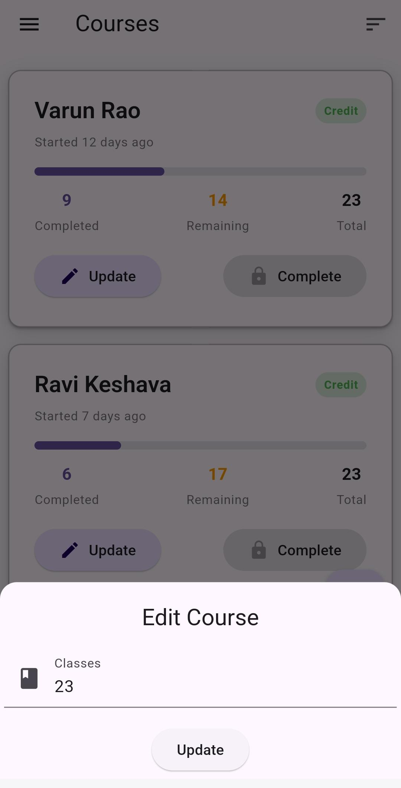 |
| Swipe to Edit | 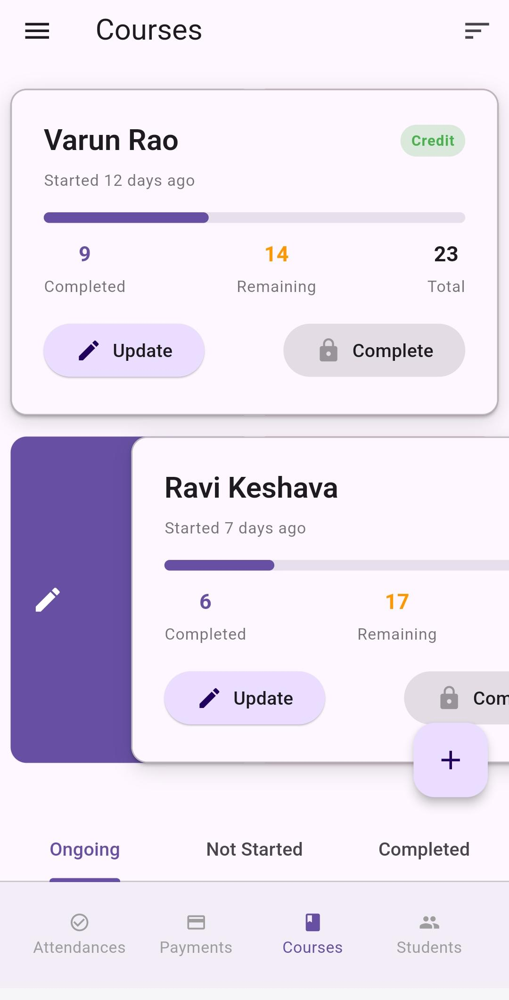 |
| Swipe to Delete | 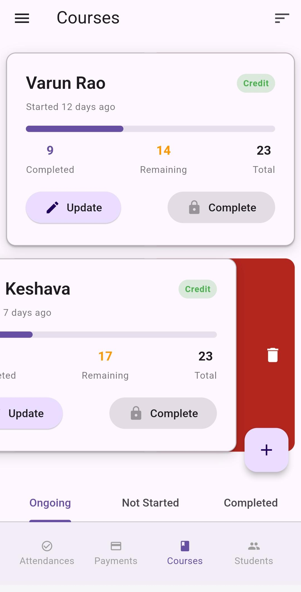 |

## 🏖️ Holiday Management
| Feature | Screenshot |
|---------|------------|
| My Holidays | 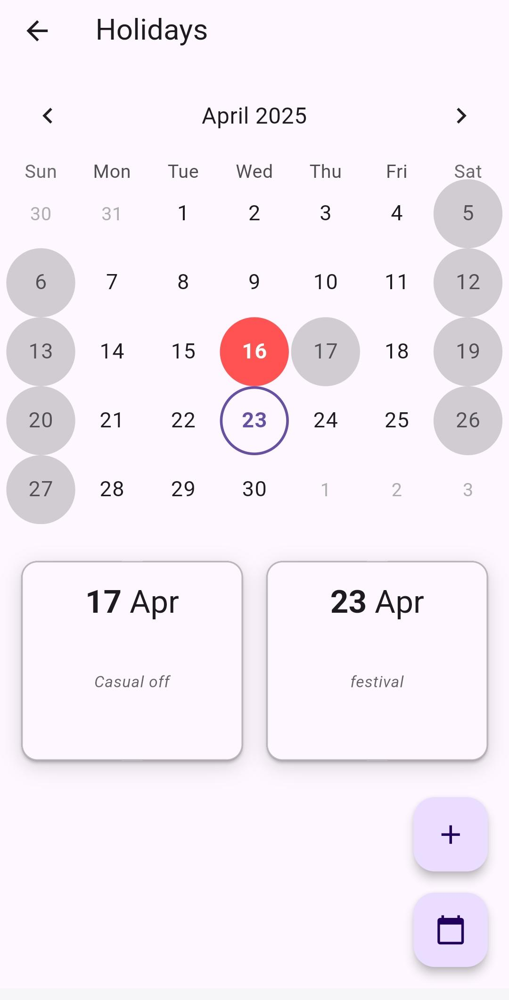 |
| Set Weekly Off | 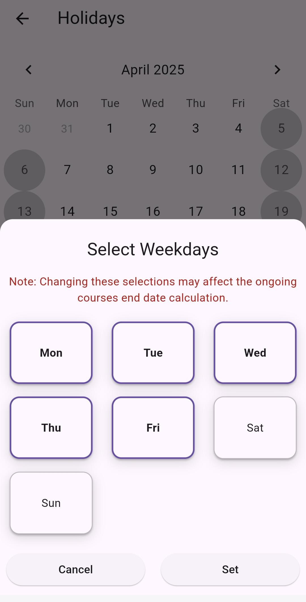 |

## 🎨 UI Customization
| Feature | Screenshot |
|---------|------------|
| Light Theme | 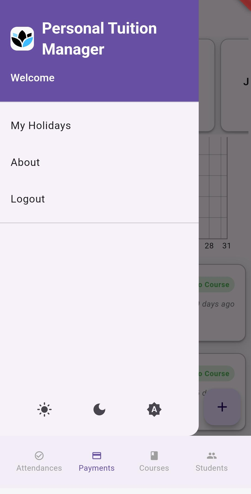 |
| Dark Theme | 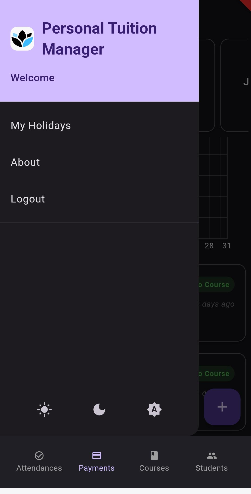 |

## ℹ️ About
| Feature | Screenshot |
|---------|------------|
| About Screen | 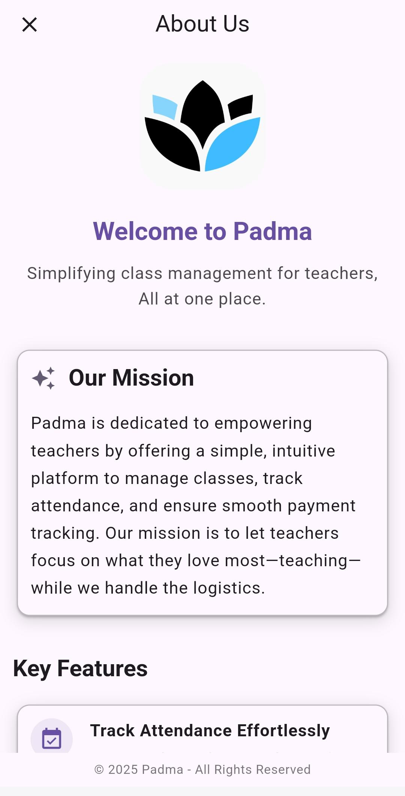 |

---

**Built for Teachers. Powered by Simplicity.**  